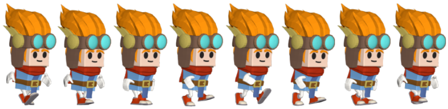
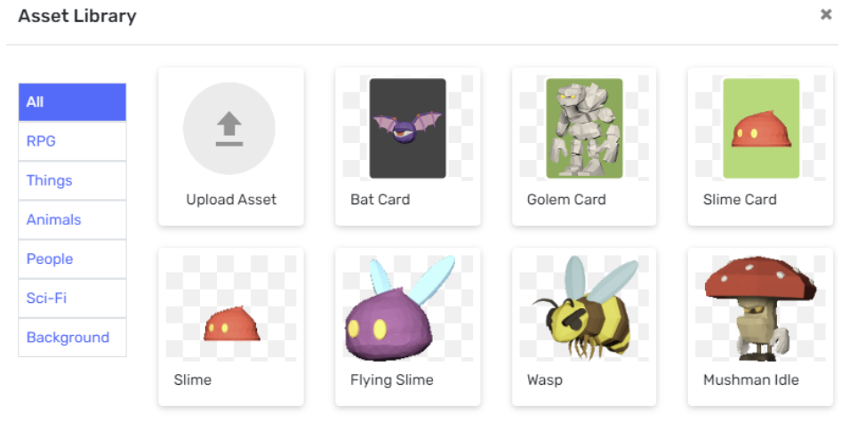

---
hide:
  - navigation
---

# PY302 Castle Clash

## Day 2

### Setting animation

Although we have our spawning card, we need to make the unit that will be created whenever we tap on the card.

This unit should play an animation from a special type of sprite, a spritesheet! A sprite sheet is a group of images all together in one large image, like this:



* Create a new class called `Unit`
* Add a new sprite to your project
	* For our example, we will be using the Slime sprite. Name it `slimeUnit`



***Have students consult the PixelPad documentation on animations.***

***Ask students how we should set up a sprite sheet for `slimeUnit`? In particular, what numbers should go in the brackets and how do we know?***

We should first create the sprite sheet and slice it into smaller sprites. To slice it, we have to know how many rows and columns this sprite has.

As you can see, our slime animation has 8 images. They are divided into 1 row and 8 columns. That’s all the information we need from this sprite for now.

``` py title="Unit - Start"
spriteSheet = sprite("slimeUnit.png", 1, 8) # (1)
```

1. Here we are creating a new sprite sheet from our `slimeUnit.png` sprite. In our example, our sprite has 1 row and 8 columns.

***Direct students to the documentation again for the next step. Ensure they recognize this pattern.***

...

``` py title="Unit - Start"
spriteSheet = sprite("slimeUnit.png", 1, 8)
anim = new_animation(spriteSheet, 20, 0, 7)
animation_set(self, anim)
```

...

### Flipping objects horizontally

Right now, our `Unit` object and `Card` objects are facing the wrong way. We can use `scaleX = -1` to flip these objects across the y axis. 

***Ask students what class this code should go in?*** - The `Unit` and `Card` classes, in the `Start` tab so that it just happens once at the beginning.

***Ask students how we will ensure that this affects objects within this class*** - `self` keyword.


``` py title="Card - Start"
self.sprite = sprite("slimeCard.png")
self.scaleX = -1 # (1)
```

1. Objects within this class are flipped across the y axis.

``` py title="Unit - Start"
spriteSheet = sprite("slimeUnit.png", 1, 8)
anim = new_animation(spriteSheet, 20, 0, 7)
animation_set(self, anim)
self.scaleX = -1 # (1)
```

1. Objects within this class are flipped across the y axis.


## Day 3

### Section

Content here...
